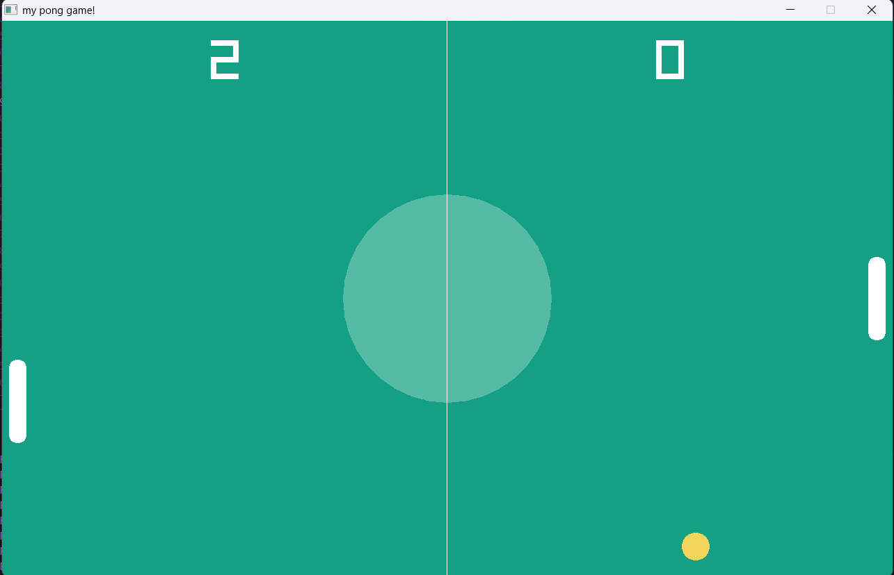

# 🕹️ PONG-GAME-PROJECT

## 📷 Screenshot



A simple Pong game built using **C++** and the **raylib** library.  
This project demonstrates basic game development concepts like movement, collision detection, and real-time rendering.

---

## 🚀 Features
- Classic Pong gameplay
- Player vs Player controls
- Ball movement and collision physics
- Score tracking system
- Smooth rendering using raylib

---

## 🛠️ Tech Stack
- **Language:** C++
- **Library:** raylib

---

## 🎮 Controls
- Player 1: W (up), S (down)
- Player 2: Up Arrow (↑), Down Arrow (↓)

---

## ▶️ How to Run
1. Install raylib on your system
2. Compile the code:
   ```bash
   g++ main.cpp -o pong -lraylib -lopengl32 -lgdi32 -lwinmm
